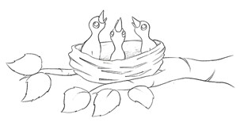

#  ESG Value Mining Program - Architecture 🚧
[ESG_VM] - [ESG_VM_PGM] - <b>[ESG_VM_PGM_Architecture]</b>

<table>
  <tr>
    <td>
      
    </td>
    <td>
      The architecture defines how the program will be divided. The parts of the program are: datasets, colectors, broker and orchestrators. The name given         for this set of projects is: "The Nest". 
    </td>
    <td>
      
    </td>
  </tr>
</table>

<table>
  <tr>
    <td>
      
    </td>
    <td>
      <b>The Nest [TN]</b>  
      The nest is formed by database structure (to assess needs, actions and results), colectors (to capture         and treat the infos), broker           (to route the needs for the correct consumers) and orchestrators (value and broker orchestration).
    </td>
  </tr>
</table>

<table>
  <tr>
    <td width="500px" align="center"><a><b>DRAWING</b></a></td>
    <td width="500px" align="center"><a><b>REPOSITORIES</b></a></td>
  </tr>
  
  <tr>
    <td width="500px" align="center"></td>
    <td width="500px" align="center">
        

            
🛒  [Consumers] 

            
🚦  [Broker] 

            
👮  [Orchestrators] 

            
🎣  [Colectors]

            
🗄️  [Datasets]

        

    </td>
  <tr>
</table>

