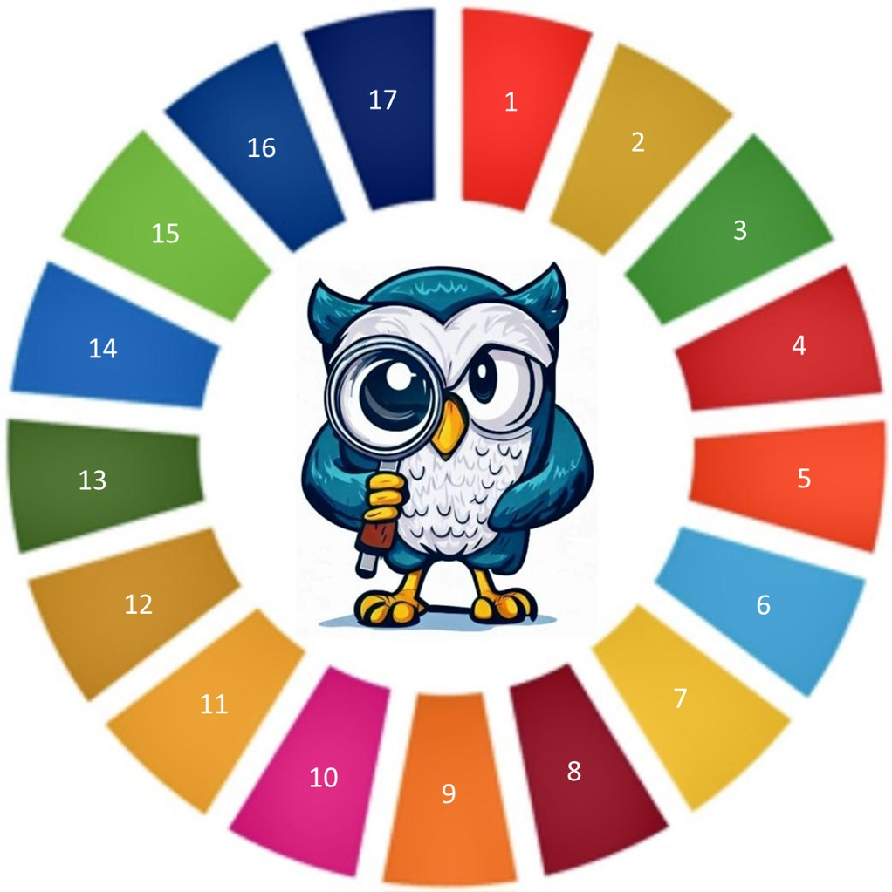
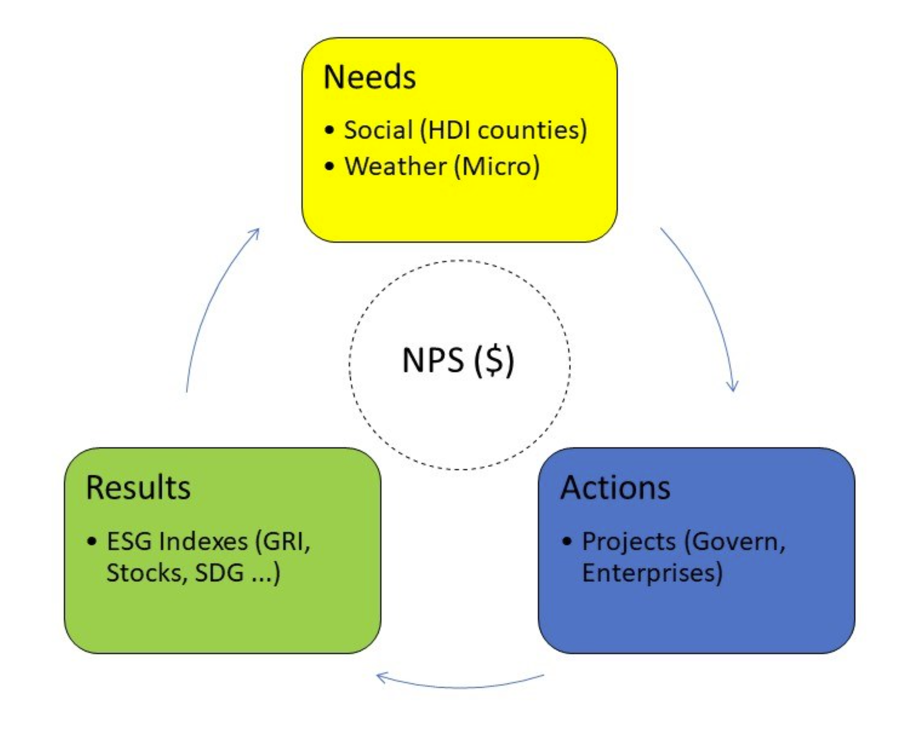

# 🚧ESG Value Mining
<b>[ESG_VM]</b>
<table>
  <tr>
    <td></td>
    <td>
      <b>ESG Value Mining [ESG_VM]</b>   
      The ambitious objective of creating an ESG virtuous cycle with: needs, actions and results.
    </td>
    <td></td>
  </tr>
</table>

  <table>
    <tr>
      <td><link rel="Starting" href="https://avalcorp.github.io/ESG_VM/Product.html"></td>
      <td><📓></td>
    </tr>
  </table>

&nbsp;&nbsp;&nbsp;&nbsp;&nbsp;&nbsp;&nbsp;&nbsp;&nbsp;&nbsp;&nbsp;&nbsp;&nbsp;&nbsp;&nbsp;&nbsp;&nbsp;&nbsp;&nbsp;&nbsp;&nbsp;&nbsp;&nbsp;&nbsp;&nbsp;&nbsp;&nbsp;&nbsp;🏁[Starting](https://avalcorp.github.io/ESG_VM/Product.html)&nbsp;&nbsp;&nbsp;&nbsp;&nbsp;&nbsp;&nbsp;&nbsp;&nbsp;&nbsp;&nbsp;&nbsp;&nbsp;&nbsp;&nbsp;&nbsp;&nbsp;&nbsp;&nbsp;&nbsp;&nbsp;&nbsp;&nbsp;&nbsp;&nbsp;&nbsp;||&nbsp;&nbsp;&nbsp;&nbsp;&nbsp;&nbsp;&nbsp;&nbsp;&nbsp;&nbsp;&nbsp;&nbsp;&nbsp;&nbsp;&nbsp;&nbsp;&nbsp;&nbsp;&nbsp;&nbsp;📓[Product Details](https://avalcorp.github.io/ESG_VM/Product.html)&nbsp;&nbsp;&nbsp;&nbsp;&nbsp;&nbsp;&nbsp;&nbsp;&nbsp;&nbsp;&nbsp;&nbsp;&nbsp;&nbsp;&nbsp;&nbsp;&nbsp;&nbsp;&nbsp;&nbsp;&nbsp;&nbsp;
||&nbsp;&nbsp;&nbsp;&nbsp;&nbsp;&nbsp;&nbsp;&nbsp;&nbsp;&nbsp;&nbsp;&nbsp;🌳[Program Structure](https://avalcorp.github.io/ESG_VM/Program.html)  
